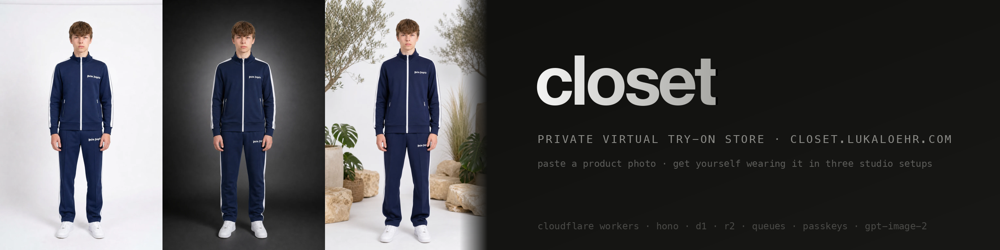

[](https://developers.cloudflare.com/workers/)
[](https://hono.dev)
[](https://www.typescriptlang.org)
[](https://platform.openai.com/docs/guides/image-generation)
[](https://ai.google.dev/gemini-api/docs/structured-output)
[-1f6feb?style=flat)](https://simplewebauthn.dev)
[](#9-security-and-license)

A private virtual try-on store at
[closet.lukaloehr.com](https://closet.lukaloehr.com).
Paste, drop, or link a product photo and the store answers with a
photorealistic image of me wearing that exact garment — in a white
cyclorama and in a dark studio. Campaign
covers on location (New York, a black-sand beach, a rooftop, …) rotate
on the landing page.

The closet also holds what I already own — shoes, jeans, tees — as
clean studio product shots, so a new piece can be tried on together
with my own sneakers instead of the base photo's.

I built the whole thing as one Cloudflare Worker: the Hono API, the
queue consumer that talks to OpenAI, the Gemini vision pass that fills
the form, WebP conversion through the Images binding, passkey and
email-code login, and a dependency-free TypeScript single-page client
served from the same Worker. There is no
framework on the client, no build step beyond one `esbuild` bundle, and
nothing runs outside Cloudflare except the image model.

## 1. What it does

Every garment you add becomes two **looks**, in a white studio and a dark studio. Each look is a single
`images/edits` call: the approved base full-body photo is the first
input, the garment photo the second, and the model is told to dress the
person in the garment and change only the background. Nothing about the
face is ever described in words — the base photo carries the identity.

| output | inputs | size | quality | wall time |
| --- | --- | ---: | --- | ---: |
| analysis (form + what is missing) | garment photo | — | Gemini 3.8 Flash, thinking off | ≈ 3 s |
| look (white · dark) | base photo + garment + paired pieces | 1152×1536 (3:4) | medium | ≈ 40 s each |
| studio shots of an owned piece (two for shoes) | my phone photo | 1024×1024 | medium | ≈ 30 s each |
| campaign cover | base photo + 2–3 garments | 1920×1088 (16:9) | high | ≈ 90 s |

Adding a piece is two steps. The upload runs the analysis first: it
fills name, brand, category, up to three colours and a one-line
description, and lists which slots a complete fit still lacks (a tracksuit lacks
shoes; a hoodie lacks bottom and shoes). The form comes back
pre-filled; what the model could not recognise (usually the brand) is
left for me to type. For a try-on, each missing slot offers the pieces
I own in that slot, and the chosen ones are worn in every generated
look. Submit returns immediately and the grid shows skeleton cards
until the queue delivers.

> **Status: live since 2026-09-06.** Generation was moved off the
> request path onto a Cloudflare Queue the same day, so a closed tab
> can no longer strand a look. Looks are generated once and never
> regenerated; a garment is the unit of work.

## 2. System

- One Worker serves the API under `/api/*`, images under `/img/*`, and
  the static client from `public/` with SPA fallback
  ([`wrangler.jsonc`](wrangler.jsonc)).
- Generation runs on the `closet-jobs` queue consumer in the same
  Worker ([`src/jobs.ts`](src/jobs.ts)): the HTTP layer inserts a
  `pending` row, enqueues `{ kind, id }`, returns `202`, and the client
  polls. Max concurrency 8, one message per batch, no retries — a failed
  look records its error instead of burning another call.
- The analysis pass ([`src/gemini.ts`](src/gemini.ts)) is one
  `generateContent` call with a response schema and `thinkingBudget: 0`,
  so it returns typed JSON in about three seconds. Without a
  `GEMINI_API_KEY` the form falls back to `gpt-5-mini` naming.
- Owned pieces live in the same `garments` table with `owned = 1`.
  They are photographed with the phone; the photo is never the product
  image. A `studio` job renders the piece alone on pure white: ghost
  mannequin for tops, flat lay for trousers and accessories, and for
  shoes two perspectives — an exact side profile and a three-quarter
  view of the pair — that the closet card crossfades between on hover.
  Looks store the `pairing` they were generated with.
- Every stored image is WebP: full size up to 2048 px at quality 86 plus
  a 640 px thumbnail for grids, converted at write time with the Images
  binding so serving is a plain R2 read with immutable cache headers
  ([`src/images.ts`](src/images.ts)). A 2.5 MB PNG cover becomes
  ~250 KB.
- Login is WebAuthn passkeys (`@simplewebauthn` v14, resident keys) or a
  six-digit code e-mailed through Dairo from `closet@dairo.app`. Only
  `ALLOWED_EMAIL` gets a code; every other address is a silent no-op. A
  passkey can only be registered from an already authenticated session
  ([`src/auth.ts`](src/auth.ts)).
- Sessions are D1 rows behind an `HttpOnly`, `SameSite=Lax` cookie,
  60 days. Codes expire after 10 minutes and are rate-limited per
  address; login traffic is capped per client IP. Every mutation must
  carry this site's `Origin`; the static client ships a CSP,
  `frame-ancestors 'none'`, `nosniff` and a referrer policy
  (`public/_headers`).
- Spending is capped ([`src/budget.ts`](src/budget.ts)): analysis
  passes, gpt-image-2 calls and covers are counted per UTC hour and day
  in the `spend` table. The API pre-checks before it enqueues and answers
  `429` with the reason; the queue consumer reserves right before the
  OpenAI call and marks a job over budget as `skipped` instead of
  calling out. Defaults: 60 image calls a day (24 an hour), 6 covers a
  day, 60 analyses a day. A `settings` row `limit_<kind>_<hour|day>`
  overrides a cap without a deploy.
- Nothing runs twice: a job is claimed with one conditional `UPDATE`
  (`started_at`), a commit flips `draft` with one conditional `UPDATE`
  so a double submit enqueues once, a variant exists at most once per
  garment, one cover at a time, and a studio re-render is refused while
  one is in flight. The bulk wardrobe re-render needs
  `{ "confirm": "re-render all" }` and does at most 20 pieces.
- An hourly cron (`scheduled` in [`src/index.ts`](src/index.ts)) deletes
  abandoned drafts older than a day with their R2 objects, expired auth
  rows and stale counters, and marks jobs that never came back; the
  same sweep rides along on every upload.
- Garment ingestion accepts multipart upload, a data URL, or a public
  `https` URL (hostname checked against private ranges, body capped at
  12 MB while streaming).
- The client is ~1100 lines of plain TypeScript
  ([`client/app.ts`](client/app.ts)): history-based routing with scroll
  restoration per entry (list pages stay alive under the viewers, back
  lands on the same card), a card grid that crossfades studio → dark on
  hover, a full-screen viewer that expands from the clicked card with a
  FLIP animation (`/g/:id`), and a flowing menu band for categories,
  brands, add, and campaign. While something generates, the grid is
  polled with backoff (4 → 12 s, paused while the tab is hidden, at most
  20 minutes) and reconciled in place: only a card whose state changed
  is replaced, without re-running the entrance animation.

## 3. Architecture

```text
browser (client/app.ts, no framework)
    |
    v
Cloudflare Worker — Hono router (src/index.ts)
    |
    +--> /api/auth/*       passkeys + email code, D1 sessions (src/auth.ts)
    |
    +--> /api/garments     upload / fetch / catalogue, enqueue 3 looks
    +--> /api/hero         enqueue a campaign cover
    |          |
    |          `--> Queue closet-jobs --> consumer (src/jobs.ts)
    |                                        |
    |                                        +--> OpenAI images/edits (src/openai.ts, src/prompts.ts)
    |                                        `--> WebP via Images binding --> R2 closet-images (src/images.ts)
    |
    +--> /img/*            R2 read, immutable cache
    `--> /*                static assets from public/ (SPA fallback)
```

| Path | Contents |
| --- | --- |
| `src/index.ts` | Hono app: routing, origin check, garment ingestion, settings, references, looks, heroes, image serving, hourly sweep. |
| `src/budget.ts` | Spend counters per UTC hour/day, `precheck`/`reserve`, the housekeeping sweep and the dead-job marker. |
| `src/auth.ts` | Email codes via Dairo, WebAuthn registration and login, session cookie, `requireAuth`. |
| `src/jobs.ts` | Queue consumer: `runLook`, `runHero`, base-reference resolution, R2 image loading. |
| `src/openai.ts` | `images/edits` client (multipart, base64 decode) and the `gpt-5-mini` fallback cataloguing call. |
| `src/gemini.ts` | The analysis pass: response schema, thinking off, slot logic for what a fit is missing. |
| `src/prompts.ts` | The prompt library: categories and slots, look prompt with pairing phrases, studio-shot prompt, seven campaign scenes. |
| `src/images.ts` | WebP conversion and thumbnailing through the Images binding; key bookkeeping for deletes. |
| `client/` | The single-page client, bundled by `esbuild` into `public/app.js`. |
| `public/` | `index.html`, `styles.css`, and the built bundle (ignored). |
| `migrations/` | D1 schema: sessions, codes, challenges, passkeys, reference photos, garments, looks, heroes, settings. |
| `lab/` | The prompt experiments that produced the recipe (Node scripts). Never part of the runtime. |

## 4. Quickstart

Requires Node 20+, a Cloudflare account with Workers, D1, R2, Queues and
Images enabled, an OpenAI key with image access, and a Dairo API key for
the login e-mail.

### Local

```bash
npm install
cp .dev.vars.example .dev.vars      # OPENAI_API_KEY, DAIRO_API_KEY, RP_ID=localhost, ORIGIN=http://localhost:8787
npm run migrate:local
npm run dev                          # esbuild bundle + wrangler dev on :8787
```

### Deploy

```bash
npm run typecheck
npm run migrate                      # apply new D1 migrations remotely
npm run deploy                       # bundle + wrangler deploy to closet.lukaloehr.com
```

Secrets live in Wrangler, not in the config: `OPENAI_API_KEY`,
`DAIRO_API_KEY` (secret) and
`GEMINI_API_KEY` (an API key of the `google-cloud-project` Google Cloud project;
`gcloud services api-keys get-key-string` recovers it). The analysis
model is the plain var `GEMINI_MODEL`. Plain vars
(`ALLOWED_EMAIL`, `RP_ID`, `ORIGIN`, `DAIRO_INBOX_ID`) are in
[`wrangler.jsonc`](wrangler.jsonc).

First run: sign in with the e-mail code, upload the base full-body
photo under Settings → References, then add a garment.

## 5. HTTP API

All routes except login and `/img/*` require a session cookie.

| Method and path | Purpose |
| --- | --- |
| `GET /api/me` | Current session. |
| `POST /api/auth/email/start` · `…/verify` | Six-digit code login. |
| `POST /api/auth/passkey/login/options` · `…/verify` | Passkey login. |
| `POST /api/auth/passkey/register/options` · `…/verify` | Add a passkey to the signed-in account. |
| `GET` · `DELETE /api/auth/passkeys[/:id]` | List and remove passkeys. |
| `POST /api/auth/logout` | End the session. |
| `GET` · `PATCH /api/settings` | Base reference, image model/quality. |
| `GET` · `POST` · `PATCH` · `DELETE /api/refs[/:id]` | Reference photos of the person. |
| `GET /api/garments?owned=0|1` | Try-on pieces or the wardrobe; drafts never list. |
| `POST /api/garments[?owned=1]` | Step 1: store the image, run the analysis, return a pre-filled draft. |
| `POST /api/garments/:id/commit` | Step 2: the reviewed form plus `pairing` per slot → three looks queued (`202`), or a wardrobe piece with its studio shot queued. |
| `GET` · `PATCH` · `DELETE /api/garments/:id` | One garment with its looks and paired pieces; edit metadata; delete with images (also discards a draft). |
| `POST /api/garments/:id/looks` | Enqueue a missing variant for a garment (`409` if it exists or is in flight), optionally with a `pairing`. |
| `POST /api/garments/:id/studio` · `POST /api/wardrobe/studio` | Re-render the studio views of one owned piece, or of every owned piece (needs `{ "confirm": "re-render all" }`, max 20). |
| `DELETE /api/looks/:id` | Remove one look. |
| `GET /api/heroes` · `POST /api/hero` · `DELETE /api/hero/:id` | Campaign covers: list, generate from 2–3 garments in a scene, delete. |
| `POST /api/heroes/upload` | Store a cover made elsewhere. |
| `GET /img/*` | Immutable image read from R2. |

## 6. The generation recipe

The recipe was settled on 2026-09-06 after a day in `lab/` and is the
only thing the model is asked to do:

1. **Identity comes from a photo, not from text.** The first input is
   always the approved base full-body photo. Face, hair, skin, pose,
   hands, framing are instructed to stay exactly as in that image.
2. **Garments are reproduced, not interpreted.** Colour, fabric, logos,
   cut are to be copied from the second image; a full outfit replaces
   top and trousers, a top replaces only the tee, trousers only the
   jeans, shoes only the shoes. Paired pieces from the wardrobe follow
   as images three onwards, each with a one-line slot instruction
   ("image 3 shows shoes: replace his shoes with exactly these shoes").
3. **The variant changes only the environment.** White keeps the studio
   as is; dark relights him in a charcoal studio with a rim light.
4. **Covers are the same person two or three times in one frame**, each
   in one garment, in one of seven scenes (NYC, beach, wheel, wall,
   rooftop, garage, studio), full bodies, wide landscape.

Gemini was the first generator and was retired the same day: it could
not hold identity across variants without describing the face, and
describing the face drifted. The retired scripts stay in `lab/` for
history.

## 7. Data and storage

| Store | Name | Holds |
| --- | --- | --- |
| D1 | `closet` | `garments`, `looks`, `heroes`, `reference_photos`, `settings`, plus `sessions`, `email_codes`, `challenges`, `passkeys`. |
| R2 | `closet-images` | `garments/<id>.webp`, `studio/<id>.webp` (+ `-alt` for shoes), `looks/<id>.webp`, `heroes/<id>.webp`, `refs/<id>` and their `.t.webp` thumbnails. |
| Queue | `closet-jobs` | `{ kind: "look" \| "hero", id }` messages, consumed in-Worker. |
| Images | binding `IMG` | Write-time WebP conversion; serving never touches it. |

A look row records its variant, model and quality tag, status
(`pending` → `done` / `error`), the exact prompt, and the generation
time in milliseconds, so every image on the site can be traced back to
the call that made it. Deleting a garment cascades to its looks and
removes every R2 object of theirs.

## 8. Decision record

Choices that shaped the current build, with the reason they stuck.

| decision | why |
| --- | --- |
| OpenAI `gpt-image-2` edits instead of Gemini generation | only path that kept identity without describing the face |
| generation on a Queue, not in the request | a closed tab or a 30 s browser timeout used to strand looks mid-flight |
| no regenerate, no detail page | a card expands in place into the three variants; looks are made once |
| WebP everywhere at write time | 10× smaller covers, grid thumbnails at 640 px, zero serving cost |
| hover crossfades studio → dark, no zoom | the zoom fought the FLIP expansion and looked like a stock template |
| plain uppercase text nav with a sliding underline | replaced a gooey-nav port that added weight without adding clarity |
| passkeys first, e-mail code as the bootstrap | one allowed address, no passwords to store, works from the phone |
| `max_retries: 0` on the queue | a failed edit costs real money; record the error and let a human decide |
| analysis before generation, Gemini Flash with thinking off | the form is filled and the missing slots known in ~3 s; nothing is generated until I have reviewed it |
| draft rows instead of holding the upload client-side | the image is uploaded once, and a discarded draft is a plain delete |
| one wardrobe table, not a second entity | an owned piece and a try-on piece share cataloguing, images and deletion; `owned` is a flag |
| hard spend caps in D1, checked twice | the API refuses early with a clear `429`; the consumer refuses again right before the call, so a stuck queue or a retry can never run up a bill |
| conditional `UPDATE`s instead of locks | a claim, a commit and a re-render each flip one row with one statement; D1 has no transactions across requests, but a single statement is atomic |
| reconcile the grid, never replace it | replacing `innerHTML` every poll re-ran the card animation and made the page jump; keyed patching touches only what changed |
| scroll state in `history.state` | the viewers are overlays over a live list; closing one is a `popstate` onto the same route, which restores the scroll instead of re-rendering |

## 9. Security and license

The service is single-tenant by design: one allowed e-mail, resident
passkeys bound to `closet.lukaloehr.com`, `HttpOnly` `SameSite=Lax`
sessions, an `Origin` check on every mutation, login traffic capped per
IP, a CSP with `frame-ancestors 'none'` on the client, `noindex` on
every page, ids validated before they reach the database, and
public-URL fetches blocked from private address ranges with redirects
followed by hand. Error responses never carry internals. Reference photos of the person are stored only in R2 and are
deliberately kept out of this repository (`refs/` is ignored), as are
the experiment outputs in `lab/out/`.

This repository is private. All rights reserved; no license is granted
for reuse.
